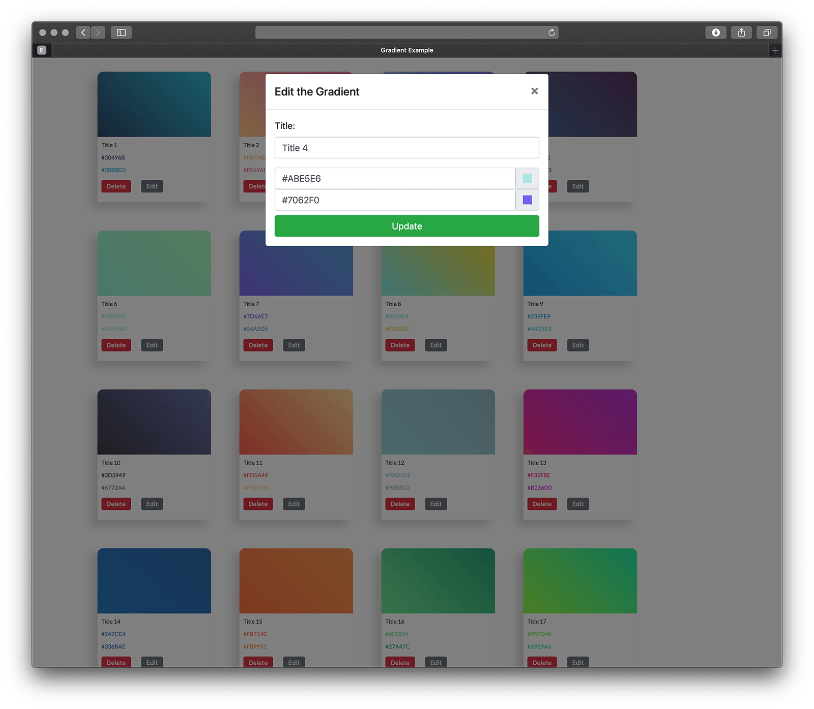

## About VueJS Laravel Colour Picker Database App

This is an example vuejs + laravel based colour picker database test application. It allows you to add color gradients with titles (See attached) using popup modals - you can then edit them or delete them. 

> **NOTE**: This was just a test.

### Contents

* [1. Required Software](#1-required-software)
* [2. Setup](#2-setup)
* [3. Example Screengrabs](#3-example-screengrabs)

## 1. Required Software

The following are required and need to be installed:

* Vagrant (Vagrant) [download here](https://www.vagrantup.com/downloads.html)
* VirtualBox (Virtual Machine) [download here](https://www.virtualbox.org)

## 2. Setup

Start by renaming the **.env.example** and the **Homestead.example.yaml** with all your required settings.

Then install the dependencies.

```
composer install
```

Now install the packages.

```
npm install
```

Next startup the vagrant box.

```
vagrant up
```

Once done setup the database migrations and seeding examples.

```
php artisan migrate --seed
```

In order to use the app compile the css and javascript (vuejs) files.

```
npm run dev

or 

npm run prod
```

## 3. Example Screengrabs

Here are a few example shots of what you should be able to view. The gradient boxes in the background are updated when the modal is updated.




## License

[MIT license](https://opensource.org/licenses/MIT).

### Version

1.0.2 Initial Setup and testing.
1.0.3 Update README with screen grabs.
